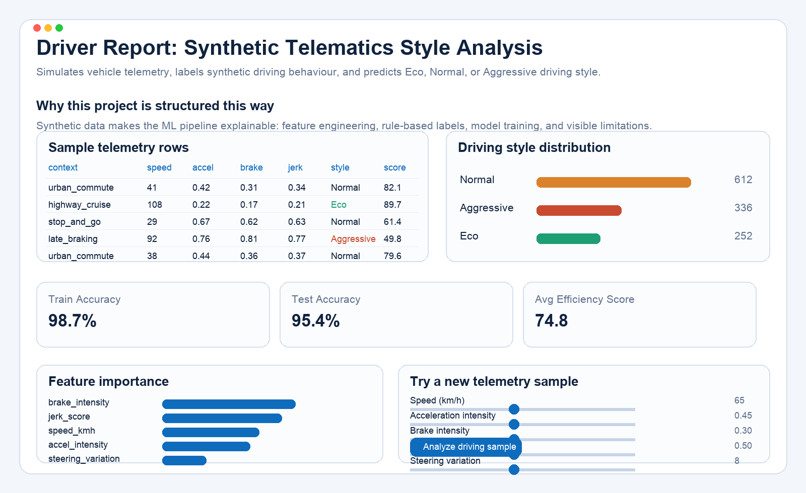

# Driver Report: Driving Style Analysis with Synthetic Telematics

Driver Report is a Streamlit machine learning project that simulates vehicle telemetry and classifies driving behaviour as `Eco`, `Normal`, or `Aggressive`.

It was built as a portfolio-ready ML demo to show the full workflow end to end:
- synthetic data generation for realistic driving contexts
- rule-based labeling for explainable targets
- feature engineering with a derived `jerk_score`
- model training with `RandomForestClassifier`
- interactive prediction in a Streamlit UI

## Project Snapshot



## What the app does

The app creates a synthetic telematics dataset across four driving contexts:
- `urban_commute`
- `highway_cruise`
- `stop_and_go`
- `late_braking`

From those telemetry features, it builds a labeled dataset, trains a classifier, shows model accuracy and feature importance, and lets the user test new driving samples with sliders.

## Why this project is useful

This project is designed to demonstrate practical ML skills in a way that is easy to explain:
- working with tabular data
- designing defensible synthetic data assumptions
- turning domain logic into labels
- training and evaluating a classifier
- presenting results in a simple product-style interface

## Tech Stack

- Python
- Streamlit
- Pandas
- NumPy
- scikit-learn

## Run locally

```bash
pip install streamlit pandas numpy scikit-learn
streamlit run dataflow/datacreate.py
```

## Limitation

The dataset is synthetic, so the model reflects engineered rules rather than real-world telematics behavior. That makes it strong as a portfolio prototype, but not a production driving-risk model.
